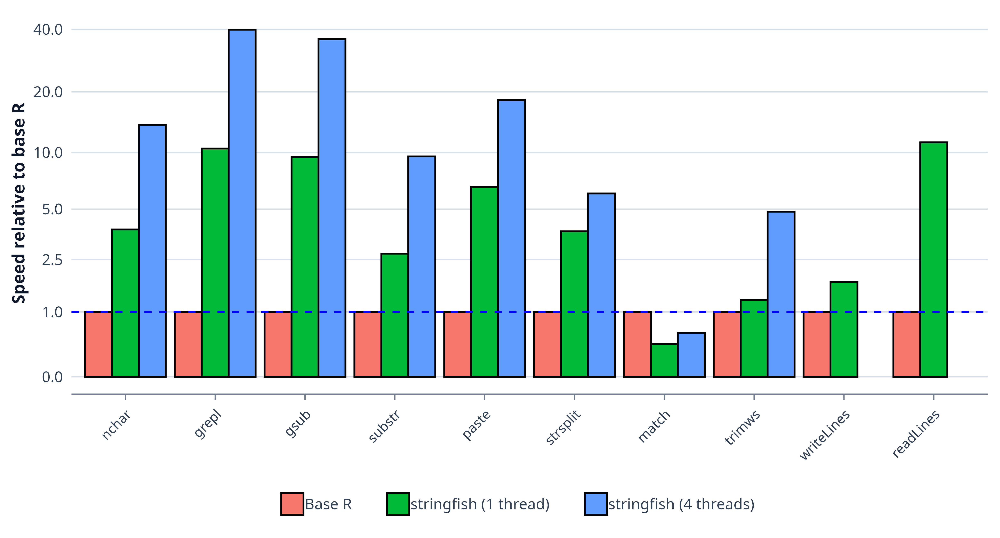

```{r, setup, echo=FALSE}
IS_GITHUB <- Sys.getenv("IS_GITHUB") != ""
```

```{r results='asis', echo=FALSE, eval=IS_GITHUB}
cat('
[](https://github.com/traversc/stringfish/actions)
[](https://cran.r-project.org/package=stringfish)
[](https://cran.r-project.org/package=stringfish)
[](https://cran.r-project.org/package=stringfish)
')
```

`stringfish` is a framework for string and sequence operations using the ALTREP system (introduced in R 3.5) as a way to represent R objects using custom memory layout.

This package has two primary goals:

- Provide R users a way to speed up common string operations compared to base R (see benchmarks below)
- Create a common ALTREP framework that can be used by other packages with full interoperability

`stringfish` currently provides two ALTREP backends with the same semantics: `sf_vec`, a simple vector of string objects, and `slice_store`, which stores strings within large contiguous blocks of memory. They make different storage tradeoffs, but the same `stringfish` operations work across both.

For text data, `stringfish` is intentionally UTF-8-centric outside of explicit byte mode, so conversions, comparisons, and ALTREP views stay consistent across normal R vectors and both backends.

## Installation
```{r eval=FALSE}
install.packages("stringfish", type="source", configure.args="--with-simd=AVX2")
```

## Benchmark

The simplest way to show the utility of the ALTREP framework is through a quick benchmark comparing `stringfish` and base R. 

```{r echo=FALSE, results='asis'}
if(IS_GITHUB) {
  cat('{width=576px}')
} else {
  cat('{width=576px}')
}
```

On favorable workloads, some functions in `stringfish` can be more than an order of magnitude faster than vectorized base R operations, and built-in multithreading can widen that gap further. On large text datasets, this can turn minutes of computation into seconds. 

## Currently implemented functions

A list of implemented `stringfish` functions and analogous base R functions:

* `sf_iconv` (`iconv`)
* `sf_nchar` (`nchar`)
* `sf_substr` (`substr`)
* `sf_paste` (`paste0`)
* `sf_collapse` (`paste0`)
* `sf_readLines` (`readLines`)
* `sf_writeLines` (`writeLines`)
* `sf_grepl` (`grepl`)
* `sf_gsub` (`gsub`)
* `sf_toupper` (`toupper`)
* `sf_tolower` (`tolower`)
* `sf_starts` (`startsWith`)
* `sf_ends` (`endsWith`)
* `sf_trim` (`trimws`)
* `sf_split` (`strsplit`)
* `sf_match` (`match` for strings only)
* `sf_compare`/`sf_equals` (`==`, ALTREP-aware semantic string equality)
* `sf_concat`/`sfc` (`c`)

Utility functions:

* `sf_vector_create` -- creates a new empty `sf_vec`-backed stringfish vector
* `sf_vector` -- backwards-compatible alias for `sf_vector_create`
* `slice_store_create` -- creates a new empty `slice_store`-backed stringfish vector
* `slice_store_create_with_size` -- creates a `slice_store`-backed stringfish vector with an explicit initial slice size
* `sf_assign` -- assign strings into a `stringfish` vector in place (like `x[i] <- "mystring"`)
* `convert_to_sf_vector` -- converts a character vector to a `stringfish` vector
* `convert_to_slice_store` -- converts a character vector to a `stringfish` slice store
* `get_string_type` -- determines string type (whether ALTREP or normal)
* `materialize` -- converts any ALTREP object into a normal R object
* `random_strings` -- creates random strings as either a `stringfish` or normal R vector
* `string_identical` -- compares strings either semantically or exactly across encodings

In addition, many R operations in base R and other packages are already ALTREP-aware (i.e. they don't cause materialization). Functions that subset or index into string vectors generally do not materialize.

* `sample`
* `head`
* `tail`
* `[` -- e.g. `x[20:30]`
* various tidyverse filters and operations
* Etc.

`stringfish` functions are not intended to exactly replicate their base R analogues. One difference is that `subject` parameters are always the first argument, which is easier to use with pipes. E.g., `gsub(pattern, replacement, subject)` becomes `sf_gsub(subject, pattern, replacement)`.

## Extensibility

`stringfish` as a framework is intended to be easily extensible. Stringfish vectors can be worked into `Rcpp` scripts or even into other packages. The example below creates an `sf_vec`-backed output because it is simple and direct, but the same indexing semantics work across both backends.

Below is a detailed `Rcpp` script that creates a function to alternate upper and lower case of strings. 

```{c eval=FALSE}
// [[Rcpp::depends(stringfish)]]
#include <Rcpp.h>
#include "sf_external.h"
using namespace Rcpp;

// [[Rcpp::export]]
SEXP sf_alternate_case(SEXP x) {
  // Iterate through a character vector using the RStringIndexer class
  // If the input vector x is a stringfish character vector it will do so without materialization
  RStringIndexer r(x);
  size_t len = r.size();
  
  // Create an output stringfish vector
  // Like all R objects, it must be protected from garbage collection
  SEXP output = PROTECT(sf_vector_create(len));
  
  // Obtain a reference to the underlying output data
  sf_vec_data & output_data = sf_vec_data_ref(output);
  
  // You can use range based for loop via an iterator class that returns RStringIndexer::rstring_info e
  // rstring info is a struct containing const char * ptr, int len, and an encoding flag
  // ptr should be treated as a byte pointer plus length, not as a null-terminated C string
  // a NA string is represented by a nullptr
  // Alternatively, access the data via the function r.getCharLenCE(i)
  size_t i = 0;
  for(auto e : r) {
    // check if string is NA and go to next if it is
    if(e.ptr == nullptr) {
      i++; // increment output index
      continue;
    }
    // Create a temporary output string and process the results.
    // This example intentionally toggles ASCII letters only.
    std::string temp(e.len, '\0');
    bool case_switch = false;
    for(int j=0; j<e.len; j++) {
      if((e.ptr[j] >= 65) && (e.ptr[j] <= 90)) { // char j is upper case
        if((case_switch = !case_switch)) { // check if we should convert to lower case
          temp[j] = e.ptr[j] + 32;
          continue;
        }
      } else if((e.ptr[j] >= 97) && (e.ptr[j] <= 122)) { // char j is lower case
        if(!(case_switch = !case_switch)) { // check if we should convert to upper case
          temp[j] = e.ptr[j] - 32;
          continue;
        }
      } else if(e.ptr[j] == 32) {
        case_switch = false;
      }
      temp[j] = e.ptr[j];
    }
    
    // Create a new vector element sfstring and insert the processed string into the stringfish vector
    // sfstring has three constructors, 1) taking a std::string and encoding, 
    // 2) a char pointer and encoding, or 3) a CHARSXP object (e.g. sfstring(NA_STRING))
    output_data[i] = sfstring(temp, e.enc);
    i++; // increment output index
  }
  // Finally, call unprotect and return result
  UNPROTECT(1);
  return output;
}

```

Example function call:
```{r eval=FALSE}
sf_alternate_case("hello world") 
[1] "hElLo wOrLd"
```
